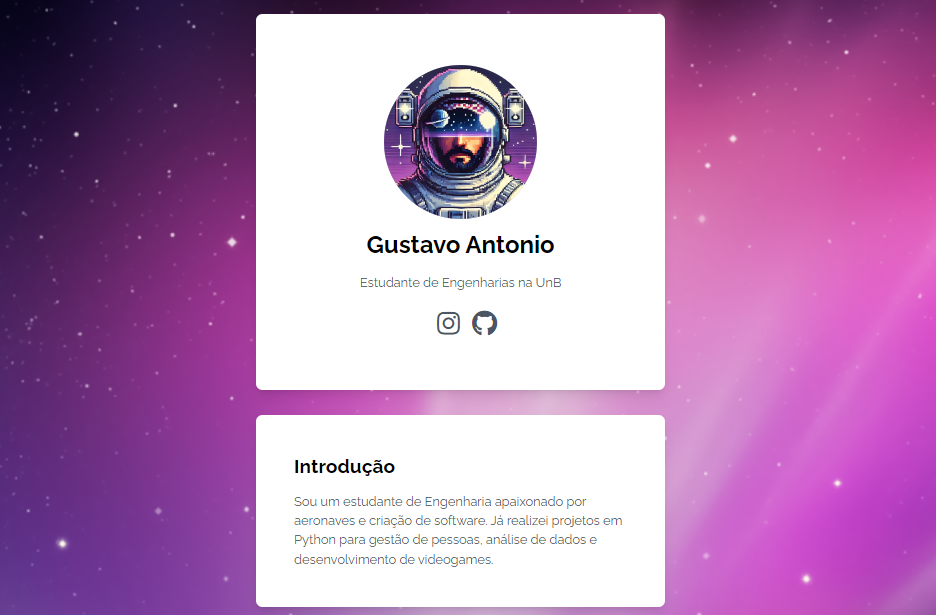

# 🌟 **Cartão pessoal Gustavo Antonio**

Um simples cartão pessoal digital desenvolvido com **Flask**, **HTML5**, **CSS3 (TailwindCSS)** e **JavaScript**, hospedado em um servidor Flask.

---

## 📸 **Demonstração**

---

## 🛠️ **Tecnologias Utilizadas**

- 🐍 **Flask** – Framework Python para desenvolvimento web  
- 🖥️ **HTML5** – Estruturação das páginas  
- 🎨 **TailwindCSS** – Estilização moderna e responsiva  
- ⚙️ **JavaScript** – Interatividade e dinamicidade  
- 📂 **FontAwesome** – Ícones para redes sociais  

---

## 🚀 **Funcionalidades**

✅ **Perfil Pessoal:** Foto, nome, descrição e links para redes sociais  
✅ **Seção de Introdução:** Breve descrição sobre mim  
✅ **Habilidades:** Listagem das principais tecnologias que domino  
✅ **Formação Acadêmica:** Histórico educacional  
✅ **Design Responsivo:** Adaptável para dispositivos móveis  


---


## 📦 **Instalação e Execução Local**

Siga os passos abaixo para rodar o projeto localmente:

1. **Clone o repositório:**
   ```bash
   git clone https://github.com/gus-ant/My_personal_card

